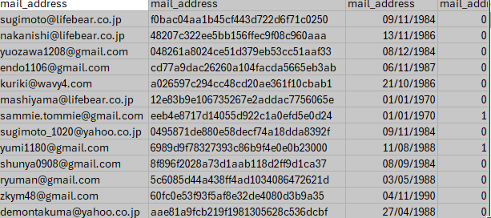

README
Project: Data Cleaning for Lifebear App Users Dataset
Overview
This Python script is designed to clean a large dataset of Lifebear.com app users from Japan. The dataset is processed in chunks, where essential data fields are verified, invalid data is removed, and the cleaned data is saved into separate files. The script identifies and discards rows with missing or invalid essential information and stores the removed records in a separate garbage file for later review.

Features
Chunk Processing:

The script reads the large CSV file in smaller chunks, allowing it to process large datasets without running out of memory.
Filtering Columns:

The script focuses on specific columns of interest, including login_id, mail_address, password, birthday_on, and gender. It ensures these columns are always present in the cleaned data.
Essential Column Check:

Rows missing data in essential columns (login_id, mail_address, or password) are considered invalid and moved to the garbage data.
Invalid Records:

Rows with missing or invalid birthday_on or gender data are also removed from the cleaned dataset and appended to the garbage file.
Duplicate Handling:

Duplicate rows based on the columns of interest are removed and stored in the garbage file.
Final Output:

After processing all chunks, the cleaned data is saved to a CSV file (merged_cleaned_data.csv), and all removed (garbage) data is stored in a separate CSV file (merged_garbage_data.csv).
Prerequisites
The script requires the following libraries:

pandas
re
os
You can install pandas using the following command:

bash
Copy code
!pip install pandas
Directory Structure
The script organizes files into folders:

Input folder (in): Contains the raw input CSV file (input.csv).

Before Cleaning folder (before_cleaning): This folder is reserved for saving the initial state of data before any cleaning operations.

Cleaned Chunks folder (cleaned_chunks): After cleaning, the chunks of data are merged into a single CSV file and stored in this folder (merged_cleaned_data.csv).

Garbage folder (garbage): All invalid and removed rows are stored in a separate file (merged_garbage_data.csv) in this folder.

How to Use
Prepare the Input CSV File:

Place the original CSV file in the input folder (in/input.csv).
Run the Script:

Execute the script in a Python environment (such as Google Colab or Jupyter Notebook).
Processing Steps:

The script processes the CSV file in chunks (10,000 rows at a time).
It filters and cleans the dataset based on the specified columns of interest.
Invalid or duplicate records are stored in the garbage data.
Outputs:

Cleaned Data: Saved in the cleaned_chunks folder as merged_cleaned_data.csv.
Garbage Data: Saved in the garbage folder as merged_garbage_data.csv.
Columns of Interest
The script focuses on the following columns:

login_id: The user's unique login identifier.
mail_address: The user's email address.
password: The user's password (hashed or otherwise).
birthday_on: The user's birthday (must not be empty).
gender: The user's gender (must not be empty).
Data Cleaning Process
Essential Data:

The script ensures that every row contains non-null values for login_id, mail_address, and password. Any rows missing these essential values are removed and moved to the garbage file.
Invalid Records:

Rows missing values in the birthday_on or gender columns are removed and stored in the garbage file.
Duplicates:

Duplicate rows based on the columns of interest are identified and removed.
Outputs
Cleaned Data (cleaned_chunks/merged_cleaned_data.csv):
This file contains only valid rows with non-null essential data and no duplicates.
Garbage Data (garbage/merged_garbage_data.csv):
This file contains rows that were removed during cleaning due to missing essential data, invalid birthday_on or gender, or because they were duplicates.
Customization
You can adjust the chunk size by modifying the chunk_size variable in the script to optimize performance for larger or smaller datasets.

License
This script is provided under the MIT License. You are free to modify and distribute the code.

This is a snippet of the merged cleaned data

